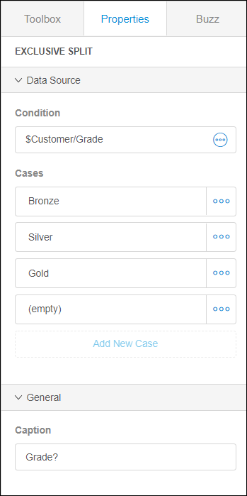
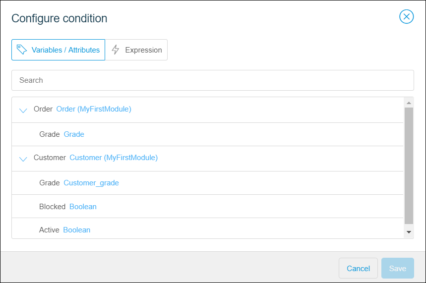
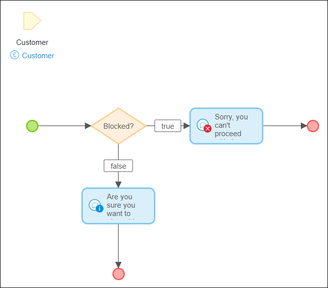
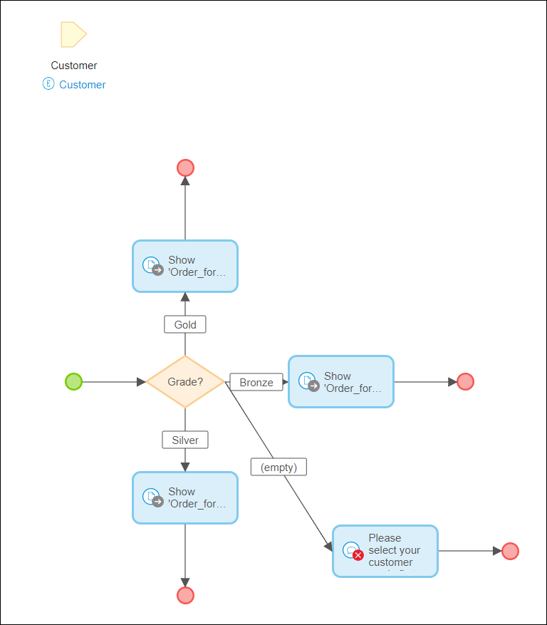

## 1 Introduction 

An exclusive split makes a decision based on a condition and follows one and only one of the outgoing flows. For example, you want to show different order forms for the customers with different grades, or you want to prevent a blocked customer make orders.

## 2 Condition

There are two ways to configure a condition for the exclusive split:

* With **Variables/ Attributes**

*  With an **Expression**

  

### 2.1 Configuring the Condition with Variables or Attributes

The following elements can be used as an exclusive split condition in the **Variable/Attributes** tab:

* Variable with Boolean data type
* Variable with Enumeration data type
* Attribute  of Boolean type
* Attribute of Enumeration type

{}

The parameters and entities which you would like to use in configuring the condition of the exclusive split should be present in the microflow, either as input parameter or as a result of an activity. 

{}

### 2.2 Configuring the Condition with an Expression

You can also configure the condition by writing the expression. For more information, see [Microflow Expressions in the Web Modeler](microflows-expressions-wm).

## 3 Cases

The number of available cases depends on the selected **Condition**. 

For the boolean type of the parameter or attribute, two values are possible: true and false.  For a detailed example, see [How to Configure an Exclusive Split](../../howto/webmodeler/webmodeler-howto-microflows-exclsplit).

The number of cases available for the enumeration type depends on the corresponding enumeration constants/values. There is also the empty case available for enumeration. If the enumeration parameter or attribute of an object is unassigned, the sequence flow with the caption (empty) is followed.

For a detailed example, see [How to Configure an Exclusive Split in the Web Modeler](../../howto/webmodeler/webmodeler-howto-microflows-exclsplit).

## 4 Caption

The caption describes to the human user what happens in this element.

## 5 Related Content

* [Microflows in the Web Modeler](microflows-wm)
* [Microflow Expressions in the Web Modeler](microflows-expressions-wm)